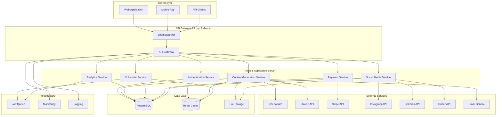

# Design Document: Full Backend Enhancement

## Overview

This design transforms the ContentGenAI system from a mock Next.js application into a production-ready, enterprise-grade SaaS platform. The enhanced backend will provide real AI-powered content generation, robust data persistence, comprehensive user management, advanced analytics, and scalable infrastructure capable of handling thousands of concurrent users.

The system follows a microservices-inspired architecture within a Next.js monolith, utilizing modern technologies including PostgreSQL with Prisma ORM, Redis for caching and session management, OpenAI/Claude APIs for content generation, and Stripe for payment processing. The design emphasizes security, scalability, performance, and maintainability while providing a seamless user experience.

## Architecture

### High-Level Architecture



### Service Architecture

The system is organized into distinct service modules within the Next.js application:

1. **Authentication Service**: Handles user registration, login, JWT management, and authorization
2. **Content Generation Service**: Manages AI-powered content creation and optimization
3. **Analytics Service**: Processes engagement data and provides insights
4. **Scheduler Service**: Manages content scheduling and automated publishing
5. **Payment Service**: Handles subscriptions, billing, and usage tracking
6. **Social Media Service**: Integrates with social platforms for publishing and data retrieval
7. **Notification Service**: Manages email, push, and in-app notifications

### Technology Stack

- **Framework**: Next.js 14 with App Router and Server Actions
- **Database**: PostgreSQL 15+ with Prisma ORM
- **Cache**: Redis for session storage and caching
- **Authentication**: JWT with refresh tokens, NextAuth.js integration
- **AI Integration**: OpenAI GPT-4, Claude 3, with fallback mechanisms
- **Payment Processing**: Stripe for subscriptions and billing
- **File Storage**: AWS S3 or compatible object storage
- **Queue System**: Bull Queue with Redis backend
- **Monitoring**: Application performance monitoring and logging
- **Deployment**: Docker containers with horizontal scaling capability

## Components and Interfaces

### Core Data Models

```typescript
// User Management
interface User {
  id: string
  email: string
  passwordHash: string
  firstName: string
  lastName: string
  avatar?: string
  subscriptionTier: 'FREE' | 'PRO' | 'ENTERPRISE'
  subscriptionStatus: 'ACTIVE' | 'CANCELLED' | 'PAST_DUE'
  usageQuota: UsageQuota
  preferences: UserPreferences
  createdAt: Date
  updatedAt: Date
}

interface UsageQuota {
  contentGenerations: number
  maxContentGenerations: number
  apiCalls: number
  maxApiCalls: number
  resetDate: Date
}

interface UserPreferences {
  defaultPlatform: string
  defaultTone: string
  defaultAudience: string
  notificationSettings: NotificationSettings
  brandSettings: BrandSettings
}

// Content Management
interface ContentPost {
  id: string
  userId: string
  title: string
  content: string
  hashtags: string[]
  platform: string
  tone: string
  audience: string
  status: 'DRAFT' | 'SCHEDULED' | 'PUBLISHED' | 'FAILED'
  scheduledAt?: Date
  publishedAt?: Date
  engagementScore?: number
  analytics: ContentAnalytics
  createdAt: Date
  updatedAt: Date
}

interface ContentAnalytics {
  views: number
  likes: number
  shares: number
  comments: number
  clicks: number
  engagementRate: number
  reach: number
  impressions: number
}

// AI Service Integration
interface AIProvider {
  name: 'OPENAI' | 'CLAUDE' | 'GEMINI'
  apiKey: string
  model: string
  maxTokens: number
  temperature: number
  isActive: boolean
  priority: number
}

interface ContentGenerationRequest {
  userId: string
  prompt: string
  platform: string
  tone: string
  audience: string
  contentType: 'CAPTION' | 'HASHTAGS' | 'OPTIMIZATION'
  aiProvider?: string
}

// Social Media Integration
interface SocialAccount {
  id: string
  userId: string
  platform: 'INSTAGRAM' | 'LINKEDIN' | 'TWITTER' | 'FACEBOOK' | 'TIKTOK'
  accountId: string
  accountName: string
  accessToken: string
  refreshToken?: string
  tokenExpiresAt: Date
  isActive: boolean
  permissions: string[]
  createdAt: Date
}

// Subscription Management
interface Subscription {
  id: string
  userId: string
  stripeSubscriptionId: string
  tier: 'FREE' | 'PRO' | 'ENTERPRISE'
  status: 'ACTIVE' | 'CANCELLED' | 'PAST_DUE' | 'UNPAID'
  currentPeriodStart: Date
  currentPeriodEnd: Date
  cancelAtPeriodEnd: boolean
  features: SubscriptionFeatures
}

interface SubscriptionFeatures {
  maxContentGenerations: number
  maxSocialAccounts: number
  maxScheduledPosts: number
  advancedAnalytics: boolean
  teamCollaboration: boolean
  apiAccess: boolean
  prioritySupport: boolean
}
```

### API Interface Specifications

```typescript
// Authentication APIs
interface AuthAPI {
  '/api/auth/register': {
    POST: {
      body: { email: string; password: string; firstName: string; lastName: string }
      response: { success: boolean; user: User; tokens: AuthTokens }
    }
  }
  
  '/api/auth/login': {
    POST: {
      body: { email: string; password: string }
      response: { success: boolean; user: User; tokens: AuthTokens }
    }
  }
  
  '/api/auth/refresh': {
    POST: {
      body: { refreshToken: string }
      response: { success: boolean; tokens: AuthTokens }
    }
  }
  
  '/api/auth/logout': {
    POST: {
      response: { success: boolean }
    }
  }
}

// Content Generation APIs
interface ContentAPI {
  '/api/content/generate': {
    POST: {
      body: ContentGenerationRequest
      response: { success: boolean; content: string; metadata: ContentMetadata }
    }
  }
  
  '/api/content/optimize': {
    POST: {
      body: { contentId: string; optimizationType: string }
      response: { success: boolean; optimizedContent: string; improvements: string[] }
    }
  }
  
  '/api/content/save': {
    POST: {
      body: Omit<ContentPost, 'id' | 'createdAt' | 'updatedAt'>
      response: { success: boolean; post: ContentPost }
    }
  }
  
  '/api/content/schedule': {
    POST: {
      body: { postId: string; scheduledAt: Date; platforms: string[] }
      response: { success: boolean; scheduledPost: ScheduledPost }
    }
  }
}

// Analytics APIs
interface AnalyticsAPI {
  '/api/analytics/dashboard': {
    GET: {
      query: { timeRange: string; platform?: string }
      response: { success: boolean; data: DashboardAnalytics }
    }
  }
  
  '/api/analytics/engagement': {
    GET: {
      query: { postId?: string; timeRange: string }
      response: { success: boolean; data: EngagementAnalytics }
    }
  }
  
  '/api/analytics/export': {
    POST: {
      body: { format: 'CSV' | 'PDF' | 'JSON'; timeRange: string; metrics: string[] }
      response: { success: boolean; downloadUrl: string }
    }
  }
}

// Social Media APIs
interface SocialAPI {
  '/api/social/connect': {
    POST: {
      body: { platform: string; authCode: string }
      response: { success: boolean; account: SocialAccount }
    }
  }
  
  '/api/social/publish': {
    POST: {
      body: { postId: string; platforms: string[]; publishAt?: Date }
      response: { success: boolean; results: PublishResult[] }
    }
  }
  
  '/api/social/analytics': {
    GET: {
      query: { accountId: string; timeRange: string }
      response: { success: boolean; data: SocialAnalytics }
    }
  }
}
```

### Service Layer Architecture

```typescript
// AI Service Layer
class AIService {
  private providers: Map<string, AIProvider>
  private rateLimiter: RateLimiter
  private cache: CacheService
  
  async generateContent(request: ContentGenerationRequest): Promise<string>
  async optimizeContent(content: string, platform: string): Promise<string>
  async generateHashtags(topic: string, platform: string): Promise<string[]>
  async predictEngagement(content: string, metadata: ContentMetadata): Promise<number>
  
  private async callAIProvider(provider: string, prompt: string): Promise<string>
  private async handleRateLimit(provider: string): Promise<void>
  private async fallbackProvider(originalProvider: string): Promise<string>
}

// Database Service Layer
class DatabaseService {
  private prisma: PrismaClient
  private redis: RedisClient
  
  // User operations
  async createUser(userData: CreateUserData): Promise<User>
  async getUserById(id: string): Promise<User | null>
  async updateUser(id: string, updates: Partial<User>): Promise<User>
  async deleteUser(id: string): Promise<void>
  
  // Content operations
  async saveContent(content: ContentPost): Promise<ContentPost>
  async getContentById(id: string): Promise<ContentPost | null>
  async getUserContent(userId: string, filters: ContentFilters): Promise<ContentPost[]>
  async updateContent(id: string, updates: Partial<ContentPost>): Promise<ContentPost>
  
  // Analytics operations
  async recordEngagement(postId: string, engagement: EngagementData): Promise<void>
  async getAnalytics(userId: string, timeRange: TimeRange): Promise<AnalyticsData>
  async getEngagementTrends(userId: string): Promise<TrendData[]>
}

// Authentication Service Layer
class AuthService {
  private jwtService: JWTService
  private passwordService: PasswordService
  private sessionService: SessionService
  
  async register(userData: RegisterData): Promise<AuthResult>
  async login(credentials: LoginCredentials): Promise<AuthResult>
  async refreshToken(refreshToken: string): Promise<AuthTokens>
  async logout(userId: string): Promise<void>
  async verifyToken(token: string): Promise<User | null>
  
  private async generateTokens(user: User): Promise<AuthTokens>
  private async hashPassword(password: string): Promise<string>
  private async verifyPassword(password: string, hash: string): Promise<boolean>
}
```

## Data Models

### Database Schema Design

The system uses PostgreSQL with Prisma ORM for type-safe database operations. The schema is designed for scalability, performance, and data integrity.

```prisma
// User Management Schema
model User {
  id                String    @id @default(cuid())
  email             String    @unique
  passwordHash      String
  firstName         String
  lastName          String
  avatar            String?
  subscriptionTier  SubscriptionTier @default(FREE)
  subscriptionStatus SubscriptionStatus @default(ACTIVE)
  emailVerified     Boolean   @default(false)
  twoFactorEnabled  Boolean   @default(false)
  createdAt         DateTime  @default(now())
  updatedAt         DateTime  @updatedAt
  
  // Relations
  posts             ContentPost[]
  socialAccounts    SocialAccount[]
  subscription      Subscription?
  usageQuota        UsageQuota?
  preferences       UserPreferences?
  sessions          UserSession[]
  analytics         UserAnalytics[]
  
  @@map("users")
}

model UserSession {
  id           String   @id @default(cuid())
  userId       String
  sessionToken String   @unique
  refreshToken String   @unique
  expiresAt    DateTime
  createdAt    DateTime @default(now())
  
  user User @relation(fields: [userId], references: [id], onDelete: Cascade)
  
  @@map("user_sessions")
}

model UsageQuota {
  id                    String   @id @default(cuid())
  userId                String   @unique
  contentGenerations    Int      @default(0)
  maxContentGenerations Int      @default(10)
  apiCalls              Int      @default(0)
  maxApiCalls           Int      @default(100)
  resetDate             DateTime
  
  user User @relation(fields: [userId], references: [id], onDelete: Cascade)
  
  @@map("usage_quotas")
}

// Content Management Schema
model ContentPost {
  id              String      @id @default(cuid())
  userId          String
  title           String
  content         String      @db.Text
  hashtags        String[]
  platform        String
  tone            String
  audience        String
  status          PostStatus  @default(DRAFT)
  scheduledAt     DateTime?
  publishedAt     DateTime?
  engagementScore Float?
  metadata        Json?
  createdAt       DateTime    @default(now())
  updatedAt       DateTime    @updatedAt
  
  // Relations
  user            User        @relation(fields: [userId], references: [id], onDelete: Cascade)
  analytics       ContentAnalytics[]
  scheduledPosts  ScheduledPost[]
  publishResults  PublishResult[]
  
  @@map("content_posts")
  @@index([userId, status])
  @@index([scheduledAt])
}

model ContentAnalytics {
  id               String      @id @default(cuid())
  postId           String
  platform         String
  views            Int         @default(0)
  likes            Int         @default(0)
  shares           Int         @default(0)
  comments         Int         @default(0)
  clicks           Int         @default(0)
  engagementRate   Float       @default(0)
  reach            Int         @default(0)
  impressions      Int         @default(0)
  recordedAt       DateTime    @default(now())
  
  post ContentPost @relation(fields: [postId], references: [id], onDelete: Cascade)
  
  @@map("content_analytics")
  @@index([postId, platform])
  @@index([recordedAt])
}

// Social Media Integration Schema
model SocialAccount {
  id              String    @id @default(cuid())
  userId          String
  platform        Platform
  accountId       String
  accountName     String
  accessToken     String
  refreshToken    String?
  tokenExpiresAt  DateTime
  isActive        Boolean   @default(true)
  permissions     String[]
  metadata        Json?
  createdAt       DateTime  @default(now())
  updatedAt       DateTime  @updatedAt
  
  user User @relation(fields: [userId], references: [id], onDelete: Cascade)
  publishResults PublishResult[]
  
  @@map("social_accounts")
  @@unique([userId, platform, accountId])
}

model ScheduledPost {
  id          String      @id @default(cuid())
  postId      String
  platform    String
  scheduledAt DateTime
  status      ScheduleStatus @default(PENDING)
  attempts    Int         @default(0)
  lastError   String?
  createdAt   DateTime    @default(now())
  updatedAt   DateTime    @updatedAt
  
  post ContentPost @relation(fields: [postId], references: [id], onDelete: Cascade)
  
  @@map("scheduled_posts")
  @@index([scheduledAt, status])
}

model PublishResult {
  id              String    @id @default(cuid())
  postId          String
  socialAccountId String
  platform        String
  platformPostId  String?
  status          PublishStatus
  publishedAt     DateTime?
  error           String?
  metadata        Json?
  
  post          ContentPost   @relation(fields: [postId], references: [id], onDelete: Cascade)
  socialAccount SocialAccount @relation(fields: [socialAccountId], references: [id], onDelete: Cascade)
  
  @@map("publish_results")
  @@index([postId])
  @@index([socialAccountId])
}

// Subscription Management Schema
model Subscription {
  id                   String             @id @default(cuid())
  userId               String             @unique
  stripeSubscriptionId String             @unique
  tier                 SubscriptionTier
  status               SubscriptionStatus
  currentPeriodStart   DateTime
  currentPeriodEnd     DateTime
  cancelAtPeriodEnd    Boolean            @default(false)
  features             Json
  createdAt            DateTime           @default(now())
  updatedAt            DateTime           @updatedAt
  
  user User @relation(fields: [userId], references: [id], onDelete: Cascade)
  
  @@map("subscriptions")
}

// Enums
enum SubscriptionTier {
  FREE
  PRO
  ENTERPRISE
}

enum SubscriptionStatus {
  ACTIVE
  CANCELLED
  PAST_DUE
  UNPAID
}

enum PostStatus {
  DRAFT
  SCHEDULED
  PUBLISHED
  FAILED
}

enum Platform {
  INSTAGRAM
  LINKEDIN
  TWITTER
  FACEBOOK
  TIKTOK
}

enum ScheduleStatus {
  PENDING
  PROCESSING
  COMPLETED
  FAILED
}

enum PublishStatus {
  SUCCESS
  FAILED
  PENDING
}
```

### Caching Strategy

Redis is used for multiple caching layers to improve performance:

```typescript
interface CacheStrategy {
  // Session Management
  userSessions: {
    key: `session:${string}`
    ttl: 86400 // 24 hours
    data: UserSession
  }
  
  // Content Generation Cache
  aiResponses: {
    key: `ai:${string}:${string}` // provider:hash
    ttl: 3600 // 1 hour
    data: string
  }
  
  // Analytics Cache
  dashboardData: {
    key: `analytics:${string}:${string}` // userId:timeRange
    ttl: 1800 // 30 minutes
    data: DashboardAnalytics
  }
  
  // Rate Limiting
  rateLimits: {
    key: `rate:${string}:${string}` // service:userId
    ttl: 3600 // 1 hour
    data: number
  }
  
  // Social Media Tokens
  socialTokens: {
    key: `social:${string}:${string}` // platform:accountId
    ttl: 7200 // 2 hours
    data: SocialTokens
  }
}
```

Now I'll continue with the Correctness Properties section. First, let me use the prework tool to analyze the acceptance criteria.

<function_calls>
<invoke name="prework">
<parameter name="featureName">full-backend-enhancement

## Correctness Properties

*A property is a characteristic or behavior that should hold true across all valid executions of a system—essentially, a formal statement about what the system should do. Properties serve as the bridge between human-readable specifications and machine-verifiable correctness guarantees.*

### AI Integration Properties

**Property 1: AI Provider Integration and Fallback**
*For any* content generation request, the AI_Service should successfully connect to at least one configured AI provider (OpenAI, Claude, Gemini) and return valid content, with automatic fallback to alternative providers when the primary provider fails.
**Validates: Requirements 1.1, 1.5, 1.6**

**Property 2: Content Generation Consistency and Quality**
*For any* combination of topic, platform, tone, and audience parameters, the Content_Generator should produce contextually relevant content that contains elements related to all input parameters, with consistent quality across multiple generations using the same parameters.
**Validates: Requirements 1.2, 1.7**

**Property 3: Platform-Optimized Content Generation**
*For any* content optimization request, the Content_Optimizer should produce improved content with measurable enhancements for the target platform, and hashtag generation should return platform-appropriate tags relevant to the input topic.
**Validates: Requirements 1.3, 1.4**

### Database and Data Persistence Properties

**Property 4: Database Migration from localStorage**
*For any* data operation (create, read, update, delete), the Database_Layer should use the production database (PostgreSQL) instead of localStorage, ensuring all operations are persistent across application restarts.
**Validates: Requirements 2.1**

**Property 5: Complete Data Persistence with Metadata**
*For any* content creation or post saving operation, the Database_Layer should store all content data with proper indexing, complete metadata including timestamps, and maintain referential integrity between users, posts, analytics, and subscriptions.
**Validates: Requirements 2.2, 2.3, 2.4**

**Property 6: Database Transaction Integrity and Performance**
*For any* set of related database operations, the Database_Layer should maintain ACID transaction properties for consistency, implement connection pooling for performance, and support schema migrations without data loss.
**Validates: Requirements 2.5, 2.6, 2.8**

**Property 7: Backup and Recovery Capabilities**
*For any* point in time, the Backup_System should maintain automated daily backups that can be successfully restored to recover all user data and system state.
**Validates: Requirements 2.7**

### Authentication and Security Properties

**Property 8: Secure User Registration and Token Management**
*For any* user registration or password reset request, the User_Manager should implement secure email verification workflows with cryptographically secure token generation and proper expiration handling.
**Validates: Requirements 3.1, 3.5**

**Property 9: Multi-Method Authentication Support**
*For any* authentication attempt, the User_Manager should support multiple authentication methods (email/password, OAuth providers) and successfully authenticate valid credentials while rejecting invalid ones.
**Validates: Requirements 3.2**

**Property 10: JWT Session Management**
*For any* user login, the Security_Manager should generate valid JWT access tokens with refresh tokens, implement automatic logout after inactivity, and maintain secure session state in Redis.
**Validates: Requirements 3.3, 3.6**

**Property 11: Role-Based Access Control**
*For any* resource access attempt, the Security_Manager should enforce role-based permissions (free, premium, admin) and only allow access to resources appropriate for the user's subscription tier and role.
**Validates: Requirements 3.4**

**Property 12: User Data Management and Compliance**
*For any* user profile update or account deletion request, the User_Manager should properly handle data changes, support GDPR-compliant data deletion, and maintain audit trails for compliance.
**Validates: Requirements 3.7**

**Property 13: Two-Factor Authentication**
*For any* user with 2FA enabled, the Security_Manager should require both primary authentication and valid 2FA token before granting access to the account.
**Validates: Requirements 3.8**

### Analytics and Performance Tracking Properties

**Property 14: Real Engagement Metrics Collection**
*For any* published content with connected social media accounts, the Analytics_Engine should track real engagement metrics (likes, shares, comments, reach) from the connected platforms and store them with proper timestamps.
**Validates: Requirements 4.1, 4.2**

**Property 15: Predictive Analytics and ML Models**
*For any* content with sufficient historical data, the Analytics_Engine should provide engagement predictions using trained machine learning models and generate performance forecasts with measurable accuracy.
**Validates: Requirements 4.3**

**Property 16: Analytics Reporting and Export**
*For any* analytics request, the Analytics_Engine should generate performance reports with trends and insights, provide real-time dashboard updates, and support data export in multiple formats (CSV, PDF, JSON).
**Validates: Requirements 4.4, 4.7, 4.8**

**Property 17: A/B Testing and Behavioral Analytics**
*For any* A/B test setup, the Analytics_Engine should properly track content variations, measure performance differences, and record user behavior patterns for analysis.
**Validates: Requirements 4.5, 4.6**

### Social Media Integration Properties

**Property 18: Multi-Platform Connection and Token Security**
*For any* social media platform authorization, the Social_Media_Integrator should successfully connect to major platforms (Instagram, LinkedIn, Twitter, Facebook, TikTok) and securely store API tokens with proper encryption and expiration handling.
**Validates: Requirements 5.1, 5.2**

**Property 19: Content Publishing and Data Retrieval**
*For any* content publishing request, the Social_Media_Integrator should successfully publish content to connected platforms with platform-specific formatting and retrieve real engagement data from published posts.
**Validates: Requirements 5.3, 5.4, 5.5**

**Property 20: Platform Compliance and Error Handling**
*For any* social media API interaction, the Social_Media_Integrator should respect platform rate limits, handle API errors gracefully, support bulk operations, and maintain compliance with platform posting guidelines.
**Validates: Requirements 5.6, 5.7, 5.8**

### Content Scheduling Properties

**Property 21: Content Scheduling and Queue Management**
*For any* content scheduling request, the Scheduler should store the content for future publication, support queue reordering, and provide optimal posting time suggestions based on audience analytics.
**Validates: Requirements 6.1, 6.2, 6.4**

**Property 22: Automated Publishing with Timezone Support**
*For any* scheduled content, the Scheduler should automatically publish at the correct time accounting for timezone conversions, support recurring schedules, and implement retry mechanisms for failed publications.
**Validates: Requirements 6.3, 6.5, 6.7, 6.8**

**Property 23: Scheduling Notifications**
*For any* scheduled post, the Scheduler should send notifications before and after publication attempts, keeping users informed of scheduling status.
**Validates: Requirements 6.6**

### Payment and Subscription Properties

**Property 24: Stripe Payment Integration**
*For any* payment transaction, the Payment_Processor should securely process payments through Stripe, support multiple payment methods and currencies, and handle transaction failures with proper error reporting.
**Validates: Requirements 7.1, 7.7**

**Property 25: Subscription Tier Management**
*For any* subscription change, the Payment_Processor should support multiple tiers (Free, Pro, Enterprise), immediately update access permissions upon upgrade, and properly handle renewals, cancellations, and refunds.
**Validates: Requirements 7.2, 7.3, 7.4**

**Property 26: Usage Tracking and Billing**
*For any* user activity, the Payment_Processor should track usage against subscription limits, enforce tier-based restrictions, generate accurate invoices with tax calculations, and implement dunning management for failed payments.
**Validates: Requirements 7.5, 7.6, 7.8**

### Security and Rate Limiting Properties

**Property 27: API Rate Limiting and Abuse Prevention**
*For any* API request, the Rate_Limiter should enforce per-user rate limits based on subscription tier, implement intelligent throttling to prevent abuse and DDoS attacks, and provide usage analytics for quota management.
**Validates: Requirements 8.1, 8.2, 8.7**

**Property 28: Comprehensive Security Implementation**
*For any* system interaction, the Security_Manager should implement API key authentication, encrypt sensitive data at rest and in transit, validate and sanitize all inputs, and set proper CORS and CSP headers.
**Validates: Requirements 8.3, 8.4, 8.5, 8.8**

**Property 29: Security Monitoring and Intrusion Detection**
*For any* security event, the Security_Manager should log the event with proper details and implement intrusion detection to identify and respond to potential threats.
**Validates: Requirements 8.6**

### Content Templates and Brand Management Properties

**Property 30: Brand Template Integration**
*For any* content generation with brand settings, the Content_Generator should apply custom templates with brand-specific elements, incorporate brand voice and messaging guidelines, and support brand asset management.
**Validates: Requirements 9.1, 9.2, 9.3, 9.4**

**Property 31: Team Collaboration Workflows**
*For any* team content creation, the Content_Generator should implement approval workflows with multiple reviewers, support task assignment with deadline management, and enable multi-brand management for agencies.
**Validates: Requirements 9.5, 9.6**

**Property 32: Template Management and Version Control**
*For any* template modification, the Content_Generator should maintain version history, support template sharing and marketplace functionality, and track all changes with proper versioning.
**Validates: Requirements 9.7, 9.8**

### Advanced Content Optimization Properties

**Property 33: Historical Data Learning and ML Optimization**
*For any* content optimization request, the Content_Optimizer should analyze historical performance data to improve suggestions, implement machine learning models for engagement prediction, and consider platform-specific algorithms and best practices.
**Validates: Requirements 10.1, 10.2, 10.3**

**Property 34: Competitive Analysis and Testing Recommendations**
*For any* content analysis request, the Content_Optimizer should provide A/B testing recommendations, analyze competitor content for improvement suggestions, and implement sentiment analysis with emotional impact scoring.
**Validates: Requirements 10.4, 10.5, 10.6**

**Property 35: Timing Optimization and Performance Forecasting**
*For any* audience behavior analysis, the Content_Optimizer should suggest optimal posting times based on audience patterns and provide content performance forecasting with trend analysis.
**Validates: Requirements 10.7, 10.8**

### Team Collaboration Properties

**Property 36: Team Account Management**
*For any* team account, the User_Manager should support role-based permissions, enable content calendars with team visibility, and provide team performance analytics and reporting.
**Validates: Requirements 11.1, 11.6, 11.7**

**Property 37: Collaborative Content Workflows**
*For any* team content creation, the Content_Generator should implement multi-reviewer approval workflows, support task assignment and deadline management, and send real-time notifications for team activities.
**Validates: Requirements 11.2, 11.5, 11.8**

**Property 38: Collaboration Tracking and Feedback**
*For any* collaborative editing session, the Content_Generator should track all changes with version history, support content commenting and feedback systems, and maintain audit trails of team activities.
**Validates: Requirements 11.3, 11.4**

### System Monitoring Properties

**Property 39: Performance and Health Monitoring**
*For any* system operation, the Analytics_Engine should monitor API response times, error rates, system performance, database query performance, and implement health checks for all critical components.
**Validates: Requirements 12.1, 12.2, 12.5**

**Property 40: Alerting and Status Reporting**
*For any* system issue, the Notification_Service should immediately alert administrators, provide detailed logging and error tracking, and maintain system status dashboards with uptime reporting.
**Validates: Requirements 12.3, 12.4, 12.8**

**Property 41: Usage Analytics and Auto-Scaling**
*For any* system load change, the Analytics_Engine should track user activity patterns and usage metrics, implement automated scaling based on load patterns, and maintain performance under varying loads.
**Validates: Requirements 12.6, 12.7**

### Data Export and Portability Properties

**Property 42: Complete Data Export with Format Support**
*For any* data export request, the Database_Layer should support complete data export in multiple formats (JSON, CSV, XML), include all content, analytics, and metadata, and support selective export by date range or content type.
**Validates: Requirements 13.1, 13.2, 13.4**

**Property 43: GDPR Compliance and Data Privacy**
*For any* data portability request, the Database_Layer should implement GDPR-compliant features, provide API endpoints for programmatic access, and support data anonymization for privacy compliance.
**Validates: Requirements 13.3, 13.5, 13.6**

**Property 44: Data Import and Integrity Maintenance**
*For any* data import/export operation, the Database_Layer should support bulk import from other platforms, maintain data integrity throughout the process, and ensure no data corruption or loss occurs.
**Validates: Requirements 13.7, 13.8**

### Internationalization Properties

**Property 45: Multi-Language Content Generation**
*For any* content generation request in a supported language, the Content_Generator should produce high-quality content in that language, implement cultural context awareness, and consider local trends and cultural sensitivities.
**Validates: Requirements 14.1, 14.2, 14.3**

**Property 46: Translation and Localization Support**
*For any* translation request, the Content_Generator should support translation workflows, implement language-specific optimization for hashtags and keywords, and properly handle right-to-left languages and special character sets.
**Validates: Requirements 14.4, 14.5, 14.6**

**Property 47: Global Analytics and Scheduling**
*For any* international user, the Content_Generator should provide region-specific analytics and performance metrics, implement timezone-aware scheduling for global audiences, and handle cultural differences in content performance.
**Validates: Requirements 14.7, 14.8**

### Content Moderation Properties

**Property 48: Automated Content Moderation**
*For any* generated content, the Content_Generator should implement AI-powered moderation to detect inappropriate content, check against platform-specific community guidelines, and flag or block publication of violating content.
**Validates: Requirements 15.1, 15.2, 15.3**

**Property 49: Intellectual Property and Policy Compliance**
*For any* content analysis, the Content_Generator should detect potential copyright and trademark violations, support custom content policies and filtering rules, and implement age-appropriate content filtering.
**Validates: Requirements 15.4, 15.5, 15.7**

**Property 50: Manual Review and Audit Logging**
*For any* content moderation action, the Content_Generator should provide content review queues for manual moderation and maintain comprehensive audit logs for compliance reporting.
**Validates: Requirements 15.6, 15.8**

## Error Handling

### Error Classification and Response Strategy

The system implements a comprehensive error handling strategy with multiple layers of resilience:

#### AI Service Error Handling
- **Provider Failures**: Automatic failover to backup AI providers with exponential backoff
- **Rate Limiting**: Queue management with intelligent retry mechanisms
- **Invalid Responses**: Content validation with fallback to cached responses
- **Timeout Handling**: Configurable timeouts with graceful degradation

#### Database Error Handling
- **Connection Failures**: Connection pooling with automatic reconnection
- **Transaction Failures**: Automatic rollback with retry logic for transient errors
- **Migration Errors**: Rollback capabilities with data integrity verification
- **Performance Issues**: Query optimization with automatic index suggestions

#### Authentication Error Handling
- **Token Expiration**: Automatic refresh token rotation with seamless user experience
- **Invalid Credentials**: Rate limiting with account lockout protection
- **OAuth Failures**: Fallback authentication methods with clear error messaging
- **Session Management**: Graceful session cleanup with security event logging

#### Social Media Integration Error Handling
- **API Rate Limits**: Intelligent queuing with platform-specific retry strategies
- **Token Expiration**: Automatic token refresh with user notification fallbacks
- **Platform Outages**: Content queuing with automatic retry when services recover
- **Publishing Failures**: Detailed error reporting with manual retry options

#### Payment Processing Error Handling
- **Payment Failures**: Dunning management with multiple retry attempts
- **Subscription Issues**: Grace periods with service degradation rather than cutoff
- **Webhook Failures**: Event replay mechanisms with idempotency guarantees
- **Currency/Tax Errors**: Fallback calculations with manual review queues

### Error Response Format

```typescript
interface ErrorResponse {
  success: false
  error: {
    code: string
    message: string
    details?: any
    timestamp: string
    requestId: string
    retryable: boolean
    retryAfter?: number
  }
}

// Example error responses
const errors = {
  AI_PROVIDER_UNAVAILABLE: {
    code: 'AI_PROVIDER_UNAVAILABLE',
    message: 'AI service temporarily unavailable. Please try again.',
    retryable: true,
    retryAfter: 30
  },
  RATE_LIMIT_EXCEEDED: {
    code: 'RATE_LIMIT_EXCEEDED',
    message: 'Rate limit exceeded for your subscription tier.',
    retryable: true,
    retryAfter: 3600
  },
  INVALID_AUTHENTICATION: {
    code: 'INVALID_AUTHENTICATION',
    message: 'Authentication token is invalid or expired.',
    retryable: false
  }
}
```

## Testing Strategy

### Dual Testing Approach

The system employs both unit testing and property-based testing to ensure comprehensive coverage and correctness:

**Unit Testing Focus:**
- Specific examples and edge cases for each component
- Integration points between services
- Error conditions and boundary cases
- Mock external service interactions
- Database transaction scenarios

**Property-Based Testing Focus:**
- Universal properties that hold across all valid inputs
- Comprehensive input coverage through randomization
- Invariant verification across system state changes
- Round-trip properties for serialization/deserialization
- Metamorphic properties for optimization algorithms

### Property-Based Testing Configuration

**Framework Selection:**
- **TypeScript/JavaScript**: fast-check library for comprehensive property testing
- **Test Configuration**: Minimum 100 iterations per property test
- **Seed Management**: Reproducible test runs with configurable seeds
- **Shrinking**: Automatic minimal failing case generation

**Test Organization:**
```typescript
// Property test example structure
describe('AI Service Properties', () => {
  test('Property 1: AI Provider Integration and Fallback', async () => {
    await fc.assert(
      fc.asyncProperty(
        fc.record({
          topic: fc.string({ minLength: 1, maxLength: 100 }),
          platform: fc.constantFrom('instagram', 'linkedin', 'twitter'),
          tone: fc.constantFrom('professional', 'fun', 'viral'),
          audience: fc.string({ minLength: 1, maxLength: 50 })
        }),
        async (request) => {
          const result = await aiService.generateContent(request)
          
          // Property assertions
          expect(result).toBeDefined()
          expect(result.length).toBeGreaterThan(0)
          expect(result).toContain(request.topic.toLowerCase())
        }
      ),
      { numRuns: 100 }
    )
  })
})
```

**Test Tagging:**
Each property test must include a comment tag referencing the design document property:
```typescript
// Feature: full-backend-enhancement, Property 1: AI Provider Integration and Fallback
```

### Testing Infrastructure

**Test Environment Setup:**
- Isolated test databases with automatic cleanup
- Mock external services (OpenAI, Stripe, social media APIs)
- Containerized testing environment for consistency
- Parallel test execution with proper isolation

**Coverage Requirements:**
- Unit test coverage: Minimum 80% line coverage
- Property test coverage: All identified correctness properties
- Integration test coverage: All API endpoints and service interactions
- End-to-end test coverage: Critical user workflows

**Performance Testing:**
- Load testing for concurrent user scenarios
- Stress testing for system limits and graceful degradation
- Database performance testing with realistic data volumes
- API response time validation under various loads

The testing strategy ensures that both specific functionality and universal system properties are thoroughly validated, providing confidence in the system's correctness and reliability under all operating conditions.
